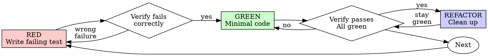

# Test-Driven Development (TDD) for C

## Overview

Write the test first. Watch it fail. Write minimal code to pass.

**Core principle:** If you didn't watch the test fail, you don't know if it tests the right thing.

**Violating the letter of the rules is violating the spirit of the rules.**

## When to Use

**Always:**
- New features
- Bug fixes
- Refactoring
- Behavior changes

**Exceptions (ask your human partner):**
- Throwaway prototypes
- Generated code
- Configuration files

Thinking "skip TDD just this once"? That thought means you're about to rationalize
around the Iron Law. Notice it. Then follow the law anyway.

## The Iron Law

```
NO PRODUCTION CODE WITHOUT A FAILING TEST FIRST
```

Write code before the test? Delete it. Start over.

**No exceptions:**
- Don't keep it as "reference"
- Don't "adapt" it while writing tests
- Don't look at it
- Delete means delete

Implement fresh from tests. Period.

## Red-Green-Refactor



### RED - Write Failing Test

Write one minimal test showing what should happen.

**Good:**
```cpp
static int g_attempts = 0;

int test_operation(void *ctx) {
    g_attempts++;
    if (g_attempts < 3) return -1;
    return 0;
}

TEST(RetryTest, RetriesFailedOperations3Times) {
    g_attempts = 0;

    int result = retry_operation(test_operation, NULL);

    EXPECT_EQ(result, 0);
    EXPECT_EQ(g_attempts, 3);
}
```
Clear name, tests real behavior, one thing

**Bad:**
```cpp
TEST(RetryTest, RetryTest) {
    MOCKER(fetch_data)
        .stubs()
        .will(returnValue(0));

    int result = process_with_retry();
    EXPECT_EQ(result, 0);
}
```
Vague name, tests mock not code

**Requirements:**
- One behavior
- Clear name
- Real code (no mocks unless unavoidable)

### Verify RED - Watch It Fail

**MANDATORY. Never skip.**

```bash
cmake --build build && ./build/tests --gtest_filter=RetryTest.*
```

Confirm:
- Test fails (not errors)
- Failure message is expected
- Fails because feature missing (not typos)

**Test passes?** You're testing existing behavior. Fix test.

**Test errors?** Fix error, re-run until it fails correctly.

### GREEN - Minimal Code

Write simplest code to pass the test.

**Good:**
```c
/* retry_operation.h */
int retry_operation(int (*fn)(void *ctx), void *ctx);

/* retry_operation.c */
int retry_operation(int (*fn)(void *ctx), void *ctx) {
    for (int i = 0; i < 3; i++) {
        int result = fn(ctx);
        if (result == 0) return 0;
    }
    return -1;
}
```
Just enough to pass

**Bad:**
```c
/* retry_operation.h */
typedef enum { LINEAR, EXPONENTIAL } Backoff;
typedef struct {
    int max_retries;
    Backoff backoff;
    void (*on_retry)(int attempt);
} RetryOptions;

int retry_operation_ex(
    int (*fn)(void *ctx),
    void *ctx,
    RetryOptions *opts
);
/* YAGNI — over-engineered for the single test */
```
Over-engineered

Don't add features, refactor other code, or "improve" beyond the test.

### Verify GREEN - Watch It Pass

**MANDATORY.**

```bash
cmake --build build && ./build/tests --gtest_filter=RetryTest.*
```

Confirm:
- Test passes
- Other tests still pass
- Output pristine (no errors, warnings)

**Test fails?** Fix code, not test.

**Other tests fail?** Fix now.

### REFACTOR - Clean Up

After green only. Run tests after every refactoring step — if a test goes RED,
you accidentally changed behavior. Undo and try a safer approach.

1. **Remove duplication** — Same logic in two places? Extract a helper.
   In C: same loop pattern, same error handling path, same validation logic.

2. **Improve names** — Names that made sense during RED may be clumsy now that
   the code works. Rename functions, structs, enums, and parameters for clarity.

3. **Extract helpers** — A function doing too many things? Split into smaller
   ones. In C: the extracted code becomes a `static` helper or graduates to
   its own `.c`/`.h` pair if it's useful elsewhere.

Keep tests green throughout. Do not add behavior. Do not write new tests during
refactor — save those for the next RED cycle.

### Repeat

Next failing test for next feature.

## Good Tests

The TDD cycle applies at any test granularity:

| Level | Test Unit | Input | Assertion Target |
|-------|-----------|-------|-----------------|
| **Function-level** | One C function | Scalar parameters (`int`, `char*`, `struct*`) | Return value, output parameter |
| **Component-level** | One module / subsystem through its public API | Structured data (binary packets, config text, message buffers, event sequences) | Observable business behavior |

The core cycle (RED-GREEN-REFACTOR) is identical. Only *what you feed in* and
*what you assert* change.

For function-level tests, see `good-test-cases.md` — boundary checklists for
individual C types, Given-When-Then structure, naming conventions, and test
doubles decision tree.

For component-level tests, see `references/component-test-design.md` — scenario
examples (binary protocol, config loader, state machine, pipeline), input
construction patterns, and component-level boundary checklists.

| Quality | Good | Bad |
|---------|------|-----|
| **Minimal** | One thing. "and" in name? Split it. | `TEST(ParserTest, ValidatesEmailAndDomainAndWhitespace)` |
| **Clear** | Name describes behavior | `TEST(ParserTest, Test1)` |
| **Shows intent** | Demonstrates desired API | Obscures what code should do |

## Why Order Matters

Tests written after code pass immediately — proving nothing. You never saw them catch the bug. Test-first forces you to witness the failure, proving the test actually tests something.

Tests-after answer "What does this do?" Tests-first answer "What should this do?" Tests-after are biased by your implementation: you test what you built, not what's required. You verify remembered edge cases, not discovered ones. Tests-first force edge case discovery before implementing.

Studies show TDD teams produce code with 40-90% fewer defects than teams that test after (Nagappan et al., "Realizing Quality Improvement Through Test Driven Development", 2008). The constraint of writing tests first forces decoupled interfaces and testable design — advantages that compound across the lifetime of the project.

For detailed counter-arguments to specific excuses, see [Common Rationalizations](#common-rationalizations).

## Common Rationalizations

| Excuse | Reality |
|--------|---------|
| "Too simple to test" | Simple code breaks. Test takes 30 seconds. |
| "I'll test after" | Tests passing immediately prove nothing. |
| "Tests after achieve same goals" | Tests-after = "what does this do?" Tests-first = "what should this do?" |
| "Already manually tested" | Ad-hoc ≠ systematic. No record, can't re-run. |
| "Deleting X hours is wasteful" | Sunk cost fallacy. Keeping unverified code is technical debt. |
| "Keep as reference, write tests first" | You'll adapt it. That's testing after. Delete means delete. |
| "Need to explore first" | Fine. Throw away exploration, start with TDD. |
| "Test hard = design unclear" | Listen to test. Hard to test = hard to use. |
| "TDD will slow me down" | TDD faster than debugging. Pragmatic = test-first. |
| "Manual test faster" | Manual doesn't prove edge cases. You'll re-test every change. |
| "Existing code has no tests" | You're improving it. Add tests for existing code. |

**"Need to explore first" — the transition protocol:**

1. Clearly designate a scratch file or directory for exploration
2. Explore freely — no tests, no constraints
3. When you have working understanding, STOP. Do not extend the exploration code
4. Write down the interface you discovered (function signatures, struct shapes)
5. Close the exploration files. Open a fresh TDD cycle
6. Write the first RED test using the interface from step 4
7. Implement fresh from the test — DO NOT copy exploration code, only use it as
   a design reference for the interface shape

The exploration code clarifies the problem. The TDD code solves it reliably.

## Red Flags - STOP and Start Over

- Code before test
- Test after implementation
- Test passes immediately
- Can't explain why test failed
- Tests added "later"
- Rationalizing "just this once"
- "I already manually tested it"
- "Tests after achieve the same purpose"
- "It's about spirit not ritual"
- "Keep as reference" or "adapt existing code"
- "Already spent X hours, deleting is wasteful"
- "TDD is dogmatic, I'm being pragmatic"
- "This is different because..."

**All of these mean: Delete code. Start over with TDD.**

## Common Mistakes

Tests must verify real behavior, not mock behavior. For full details, see `testing-anti-patterns.md`. The most frequent pitfalls:

| Mistake | Why Wrong | Fix |
|---------|-----------|-----|
| Asserting mock call counts | Tests mock invocation, not real logic | Test real behavior or unmock the function |
| `#ifdef TEST` in production `.c` files | You're testing a different binary than what ships | Move test helpers to test utility files |
| Mocking without understanding dependencies | Mocked function had side effects the test depends on | Run with real code first, then mock minimally at the right level |
| Incomplete struct initialization | `{0}` or partial init hides fields downstream code uses | Mirror the complete struct — examine the header definition |
| Over-engineering in GREEN phase | Adding options, enums, callbacks the test doesn't need | Write only the code that makes the test pass |

**Red flags:** mock setup longer than test logic, test fails when MOCKER is removed, can't explain why a mock is needed. All of these mean step back and simplify.

## Example: Bug Fix

**Bug:** Packet accepted with empty type

**RED**
```cpp
TEST(PacketTest, RejectsEmptyType) {
    Packet pkt = {"", "payload_data", 11};
    const char *error = validate_packet(&pkt);
    EXPECT_STREQ(error, "Type required");
}
```

**Verify RED**
```bash
$ cmake --build build && ./build/tests --gtest_filter=PacketTest.RejectsEmptyType
Expected: "Type required"
  Actual: (null)
[  FAILED  ] PacketTest.RejectsEmptyType
```

**GREEN**
```c
const char* validate_packet(const Packet *pkt) {
    if (pkt->type == NULL || pkt->type[0] == '\0') {
        return "Type required";
    }
    return NULL;
}
```

**Verify GREEN**
```bash
$ cmake --build build && ./build/tests --gtest_filter=PacketTest.RejectsEmptyType
[  PASSED  ] PacketTest.RejectsEmptyType
```

**REFACTOR**
Extract validation for multiple fields if needed.

## Project Setup

```cmake
cmake_minimum_required(VERSION 3.14)
project(myproject C CXX)

enable_testing()

find_package(GTest REQUIRED)
include(GoogleTest)

add_library(mylib STATIC
    src/retry_operation.c
)

add_executable(tests
    tests/retry_test.cpp
)
target_include_directories(tests PRIVATE src)
target_link_libraries(tests GTest::gtest mylib)
gtest_discover_tests(tests)
```

## Mocking Tool: mockcpp

This skill uses **mockcpp** (the `MOCKER` macro) for runtime function mocking when
function pointer injection isn't feasible. Tests are written in C++ (GTest + mockcpp)
while production code remains pure C.

Install mockcpp:
```bash
git clone https://github.com/mockcpp/mockcpp.git
cd mockcpp && mkdir build && cd build
cmake .. && make && sudo make install
```

Then link in CMake:
```cmake
target_link_libraries(tests GTest::gtest mockcpp mylib)
```

> **Prefer function pointer injection over MOCKER** — see `testing-anti-patterns.md`
> for the decision hierarchy. MOCKER is a last resort, not the default.

## Verification Checklist

Before marking work complete:

- [ ] Every new function has a test
- [ ] Watched each test fail before implementing
- [ ] Each test failed for expected reason (feature missing, not typo)
- [ ] Wrote minimal code to pass each test
- [ ] All tests pass
- [ ] Output pristine (no errors, warnings)
- [ ] Tests use real code (mocks only if unavoidable)
- [ ] Edge cases and errors covered

Can't check all boxes? You skipped TDD. Start over.

## When Stuck

| Problem | Solution |
|---------|----------|
| Don't know how to test | Write wished-for API. Write assertion first. Ask your human partner. |
| Test too complicated | Design too complicated. Simplify interface. |
| Must mock everything | Code too coupled. Use dependency injection (function pointers, context structs). |
| Test setup huge | Extract helpers. Still complex? Simplify design. |

## Debugging Integration

Bug found? Write failing test reproducing it. Follow TDD cycle. Test proves fix and prevents regression.

Never fix bugs without a test.

## Legacy Code Without Tests

> **Iron Law scope**: The rule "no production code without a failing test first"
> applies to code you are writing from scratch — new features, new modules,
> bug fixes. For legacy code that already exists, a different contract applies:
> characterization tests capture current behavior so future changes have a
> safety net. Their "failure" is deferred — they pass now, but catch
> regressions when you modify the legacy code.

The Iron Law proves your test tests the right thing. Characterization tests
document what exists so you can change it safely. Both are TDD, applied at
different starting points.

**This is NOT a loophole.** Characterization tests apply ONLY to pre-existing
code you did NOT write in this session. If you wrote the code (even "just now,"
even "as exploration"), the Iron Law applies — delete it and start with RED.
New code touching legacy modules still follows RED-GREEN-REFACTOR.

Existing C project with no tests? Don't try to write tests for everything at once. Work backward:

1. **Characterization test first** — Before touching a function, write a test that captures its current behavior (even if wrong). This is your safety net. It confirms "the code does X today" so you'll know if you accidentally break it.

```cpp
TEST(LegacyTest, ParserCurrentBehavior) {
    char *result = legacy_parse("key=value");
    EXPECT_STREQ(result, "key");    // Document what it actually returns
    free(result);
}
```

2. **New features / bug fixes follow TDD** — Any change you make to legacy code gets a failing test first, written against the external interface, not the internal implementation.

3. **Test the public interface, not static internals** — `static` helper functions buried in `.c` files are implementation details. Test them through the public functions that call them. If a static function is too complex to test indirectly, that's a design smell — extract it into its own module with a testable interface, or expose it via a function pointer for injection.

4. **One test at a time** — Don't try to cover the whole file. Pick one function, write a characterization test, proceed.

For a systematic, phased strategy for large legacy codebases — including
triage, risk-prioritized ordering, dependency-breaking patterns, progress
measurement, and stop conditions — see `references/legacy-testing-strategy.md`.

## Build Systems Beyond CMake

The principle is the same regardless of build system: **production C code compiles as a static library; test files compile as C++ (for GTest) and link against that library.**

| Build System | Approach |
|-------------|----------|
| **Make** | Separate rules: `libsrc.a` from `.c` files (cc), `tests` from `.cpp` files (c++) linking `libsrc.a` + `-lgtest -lpthread` |
| **Meson** | `static_library('src', 'foo.c')` + `executable('tests', 'test.cpp', link_with: src_lib, dependencies: gtest_dep)` |
| **Autotools** | `lib_LIBRARIES = libsrc.a` + `check_PROGRAMS = tests` (CXXLD) with `LDADD = libsrc.a $(GTEST_LIBS)` |
| **Bazel** | `cc_library(name = "src", srcs = ["foo.c"])` + `cc_test(name = "tests", srcs = ["test.cpp"], deps = [":src", "@gtest//:gtest"])` |

Core constraint: GTest requires a C++ compiler for test files. Never try to compile GTest macros in a `.c` file — it won't work.

## Testing Anti-Patterns

When adding mocks or test utilities, read `testing-anti-patterns.md` to avoid common pitfalls:
- Testing mock behavior instead of real behavior
- Adding `#ifdef TEST` blocks to production code
- Mocking without understanding dependencies

For how to design C modules that are testable from the start, read
`references/testable-design.md` — it covers opaque structs, dependency
injection, and writing code that doesn't need mocks in the first place.

For designing component-level integration tests (packet handlers, config
loaders, state machines, pipelines), read `references/component-test-design.md`
— scenario examples with complete code and input construction patterns.

## Final Rule

```
Production code → test exists and failed first
Otherwise → not TDD
```

No exceptions without your human partner's permission.
